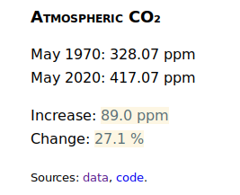

# Jekyll CO₂

Written by [William Denton](https://www.miskatonic.org/).

This is a plugin for the static web site generator [Jekyll](http://jekyllrb.com/) to show the change in atmospheric CO₂ at the Mauna Loa observatory in Hawaii.  It was inspired by [CO2Now](http://co2now.org/). The data comes from the [NOAA's Earth System Research Laboratory](http://www.esrl.noaa.gov/gmd/ccgg/trends/).

It is now text only, with no sparkline graphics.  In a browser it looks like this:

## How to install

Download `co2.rb` and put it in your `_plugins` directory.  That's all!

The CSV file downloaded is stored in your `_data` directory.  If you don't have one, it will be created.

## Configuration

By default the plugin will show CO₂ data from 50 years ago and compare it to today.

Optionally, you can add a variable in your `_config.yml`, like this:

    co2:
      years: 10

If `years` is 10, for example, it will show CO₂ from 10 years ago compared to today.

If `years` is 0, it will show CO₂ from March 1958 (the earliest data available from Mauna Loa) compared to today.

## How to use

The plugin creates an include file: `_includes/co2.html`.  Include it in a web page like this:

    

Look at the file (or the code) to see exactly how it's structured.

You could style it with CSS like this:

    #co2 {
	}

    #co2 #co2_inside {
      border: thin solid red;
      padding: 5px;
    }

    #co2 > .highlight {
      color: red;
    }

    #co2 .co2_source {
      font-size: smaller;
    }

## To try

* [UnicodePlot](https://github.com/red-data-tools/unicode_plot.rb)

## License

GPL v3.  See [LICENSE](LICENSE).
